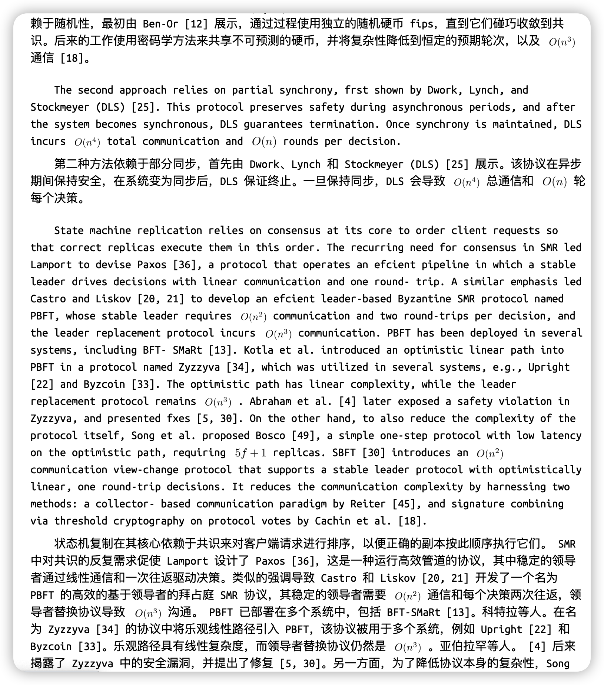
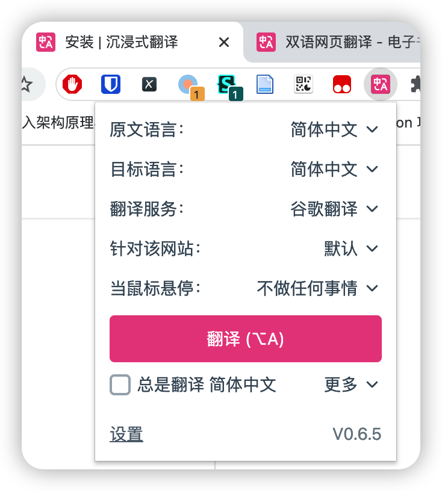

# flow-pdf

`flow-pdf` 是一个提供丝滑阅读体验的 PDF to HTML 转换器

## 功能特点

- 全文自动翻译

  `flow-pdf` 适配全文自动翻译功能，支持中英文对照，让您在阅读英文文献时不再需要翻译软件。

- 行内公式位置正确

  `flow-pdf` 能够正确处理行内公式的位置，确保转换后的 HTML 文档中的公式显示准确无误，甚至翻译结果中公式也处于正确的位置。

- 图表显示正常

  `flow-pdf` 能够正确识别 PDF 文档中的图表，并将其嵌入到转换后的 HTML 文档中，确保图表正常显示。

- 自定义样式

  `flow-pdf` 支持自定义 CSS 样式，您可以使用自己喜欢的字体进行文档阅读。

- 简洁 HTML

  `flow-pdf` 生成的 HTML 文档非常简洁，不会包含任何无用的标签，便于后期处理。

## 使用方法

前往测试网站 <https://flow-pdf.117503445.top>

### 翻译

目前翻译功能基于 [沉浸式翻译](https://immersive-translate.owenyoung.com) 拓展

请先 [安装](https://immersivetranslate.com/docs/installation) 拓展

然后在拓展设置中点击翻译按钮，或配置自动开启翻译

（值得一提的是，这个拓展真的好用！

### 注意事项

- 现在还处于内测阶段，在解析某些 PDF 时可能会出现错误，请把错误的 PDF 发送给开发者 / 提 issue。
- 目前测试网站只处理 20MB 内的 PDF，且处理结果在 7 天后会自动删除。如果需要长期使用，可以根据 [进阶使用技巧](./docs/advance.zh_CN.md) 自建实例。
- 本转换器主要支持计算机生成 （LaTeX, Word ...）的 PDF，可能无法正确转换扫描版 PDF。
